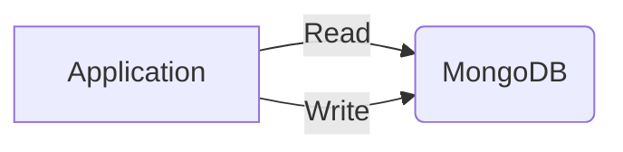

## Instructions

The steps to create a docker cluster are as follows.
- Start one instance of MongoDB.
- Initiate the Replica Set.

Once you have a MongoDB cluster up and running, you will be able to experiment with it.

How it will look like:



### Create docker compose file
```yaml
version: "3.9"
networks:
  mongodb-network:
    name: "mongodb-network"
    driver: bridge
services:
  mongodb:
    image: "mongo:6.0.4"
    container_name: "mongodb"
    networks:
      - mongodb-network
    hostname: "mongodb"
    ports:
      - "27017:27017"
    restart: "always"
    entrypoint: [ "/usr/bin/mongod", "--bind_ip_all", "--replSet", "myReplicaSet" ]
  mongoinit:
    image: "mongo:6.0.4"
    container_name: "mongodb_replSet_initializer"
    restart: "no"
    depends_on:
      - mongodb
    networks:
      - mongodb-network
    command: >
      mongosh --host mongodb:27017 --eval "rs.initiate({
       _id: \"myReplicaSet\",
       members: [
         {_id: 0, host: \"mongodb\"}
       ]
      })"
```

### Launch it
```shell
docker compose up
```

### Test and verify replica set
```shell
docker exec -it mongodb mongosh --eval "rs.status()"
```

## References
- [Convert a Standalone to a Replica Set](https://www.mongodb.com/docs/manual/tutorial/convert-standalone-to-replica-set/)
