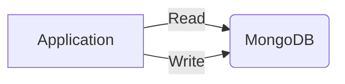

## Instructions

The steps to create a docker cluster are as follows.
- Start one instance of MongoDB.
- Initiate the Replica Set.

Once you have a MongoDB cluster up and running, you will be able to experiment with it.

How it will look like:



### Run MongoDB in docker
```shell
docker run -d -p 27017:27017 --name mongodb mongo:6.0.4 mongod --replSet myReplicaSet
```

### Initiate replica set
```shell
docker exec -it mongodb mongosh --eval "rs.initiate({
 _id: \"myReplicaSet\",
 members: [
   {_id: 0, host: \"localhost\"}
 ]
})"
```

### Test and verify replica set
```shell
docker exec -it mongodb mongosh --eval "rs.status()"
```

## References
- [Convert a Standalone to a Replica Set](https://www.mongodb.com/docs/manual/tutorial/convert-standalone-to-replica-set/)
