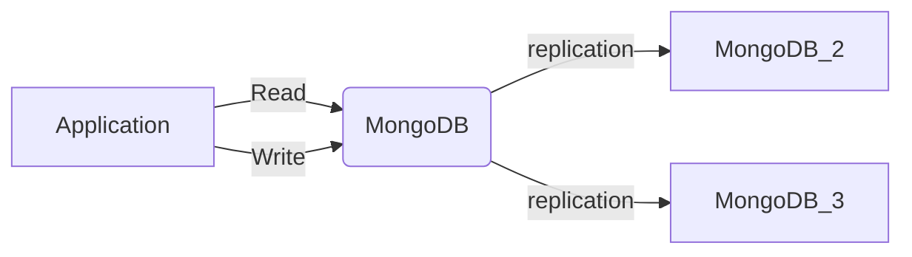

## Instructions

The steps to create a docker cluster are as follows.
- Create a Docker network.
- Start three instances of MongoDB.
- Initiate the Replica Set.

Once you have a MongoDB cluster up and running, you will be able to experiment with it.

How it will look like:



### Create a Docker Network
```shell
docker network create mongodb-network
```

### Run MongoDB in docker
```shell
docker run -d -p 27017:27017 --name mongodb  --network mongodb-network mongo:6.0.4 mongod --replSet myReplicaSet --bind_ip localhost,mongodb
docker run -d -p 27018:27017 --name mongodb2 --network mongodb-network mongo:6.0.4 mongod --replSet myReplicaSet --bind_ip localhost,mongodb2
docker run -d -p 27019:27017 --name mongodb3 --network mongodb-network mongo:6.0.4 mongod --replSet myReplicaSet --bind_ip localhost,mongodb3
```

### Initiate replica set
```shell
docker exec -it mongodb mongosh --eval "rs.initiate({
 _id: \"myReplicaSet\",
 members: [
   {_id: 0, host: \"mongodb\"},
   {_id: 1, host: \"mongodb2\"},
   {_id: 2, host: \"mongodb3\"}
 ]
})"
```

### Test and verify replica set
```shell
docker exec -it mongodb mongosh --eval "rs.status()"
```

## References
- [Deploying a MongoDB Cluster with Docker](https://www.mongodb.com/compatibility/deploying-a-mongodb-cluster-with-docker)
