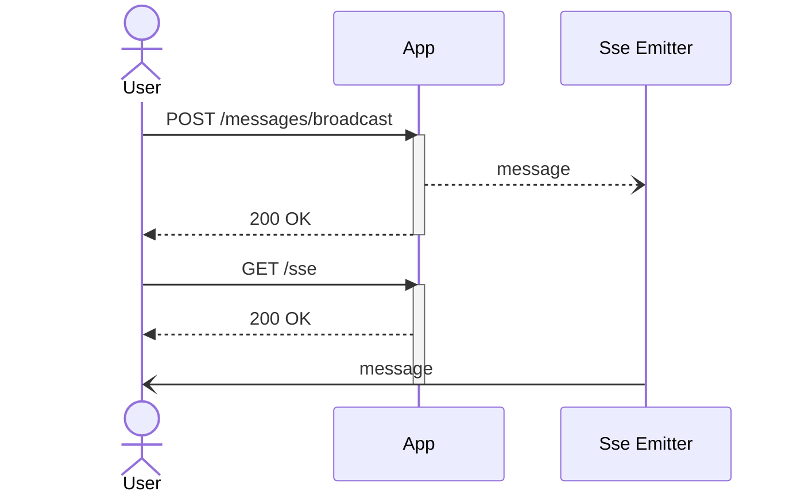

# What will we do

Service which will broadcast received messages through an SSE connection to any subscribed user



## Contracts

### OpenAPI 3 - synchronous request

It's quite easy to describe path which will receive message to broadcast

```json
{
  "openapi": "3.1.0",
  "info": {
    "title": "SSE broadcast API",
    "description": "Quarkus SSE example",
    "version": "1.0.0"
  },
  "servers": [
    {
      "url": "http://localhost:8080"
    }
  ],
  "paths": {
    "/messages/broadcast": {
      "post": {
        "summary": "Broadcast message",
        "operationId": "broadcastMessage",
        "tags": [
          "messages"
        ],
        "requestBody": {
          "description": "Message to broadcast",
          "required": true,
          "content": {
            "application/json": {
              "schema": {
                "$ref": "#/components/schemas/MessageToBroadcast"
              },
              "example": "broadcast this message :rocket:"
            }
          }
        },
        "responses": {
          "200": {
            "description": "message received"
          }
        }
      }
    }
  },
  "components": {
    "schemas": {
      "MessageToBroadcast": {
        "type": "object",
        "required": [
          "message"
        ],
        "properties": {
          "message": {
            "type": "string"
          }
        }
      }
    }
  }
}
```

But what about messages streaming? We have to ways - OpenAPI or AsyncAPI specification.

Let's try both of them

### OpenAPI 3 - SSE

```json
{
  "openapi": "3.0.3",
  "info": {
    "title": "SSE broadcast API",
    "description": "Quarkus SSE example",
    "version": "1.0.0"
  },
  "servers": [
    {
      "url": "http://localhost:8080"
    }
  ],
  "paths": {
    "/messages": {
      "get": {
        "summary": "Receive messages",
        "operationId": "receiveMessage",
        "tags": [
          "messages"
        ],
        "responses": {
          "200": {
            "description": "messages",
            "content": {
              "text/event-stream": {
                "schema": {
                  "$ref": "#/components/schemas/MessagesStream"
                }
              }
            }
          }
        }
      }
    }
  },
  "components": {
    "schemas": {
      "MessagesStream": {
        "type": "array",
        "format": "event-stream",
        "items": {
          "type": "object",
          "required": [
            "message"
          ],
          "properties": {
            "message": {
              "type": "string",
              "example": "broadcast this message :rocket:"
            },
            "receivedAt": {
              "type": "string",
              "format": "date-time",
              "example": "2023-08-31T15:28:21.283+00:00"
            }
          }
        }
      }
    }
  }
}
```

### AsyncAPI - SSE

```json
{
  "asyncapi": "2.6.0",
  "info": {
    "title": "SSE broadcast API",
    "description": "Quarkus SSE example",
    "version": "1.0.0"
  },
  "servers": {
    "dev": {
      "url": "http://localhost:8080",
      "protocol": "http"
    }
  },
  "channels": {
    "/messages": {
      "description": "Receive messages",
      "subscribe": {
        "message": {
          "$ref": "#/components/messages/Message"
        },
        "bindings": {
          "http": {
            "type": "request",
            "method": "GET"
          }
        }
      }
    }
  },
  "components": {
    "messages": {
      "Message": {
        "payload": {
          "type": "object",
          "required": [
            "message",
            "receivedAt"
          ],
          "properties": {
            "message": {
              "type": "string",
              "example": "broadcast this message :rocket:"
            },
            "receivedAt": {
              "type": "string",
              "format": "date-time",
              "example": "2023-08-31T15:28:21.283+00:00"
            }
          },
          "additionalProperties": false
        }
      }
    }
  }
}
```

# References
- [Server-sent events](https://html.spec.whatwg.org/multipage/server-sent-events.html)
- [Quarkus](https://quarkus.io/)
- [AsyncAPI](https://www.asyncapi.com/)
- [OpenAPI](https://www.openapis.org/)
