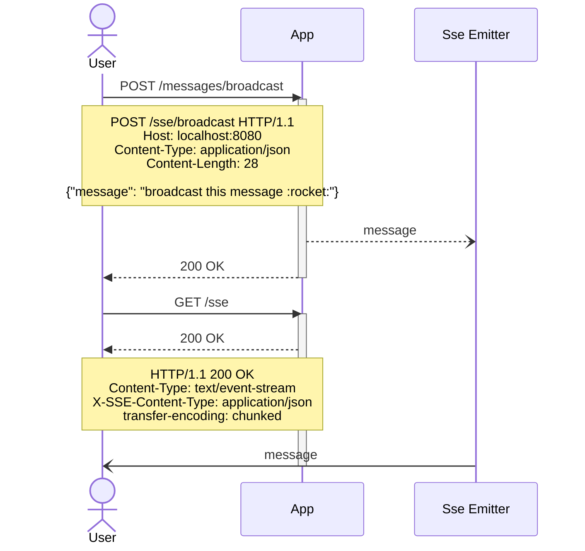

Most interesting moment for me is to compare OpenAPI specification with AsyncAPI specification in case of:

- re-using of common parts
- describing of SSE application

and compare results

# What will we document

Service which will broadcast received messages through an SSE connection to any subscribed user



# Documentation

## Common part

Let's collect all required schemas in one file:

`schemas.json`
```json
{
  "schemas": {
    "Message": {
      "type": "object",
      "additionalProperties": false,
      "required": [
        "message",
        "receivedAt"
      ],
      "properties": {
        "message": {
          "type": "string",
          "example": "broadcast this message :rocket:"
        },
        "receivedAt": {
          "type": "string",
          "format": "date-time",
          "example": "2023-08-31T15:28:21.283+00:00",
          "description": "Date-time when application received this message"
        }
      }
    },
    "MessageToBroadcast": {
      "type": "object",
      "additionalProperties": false,
      "required": [
        "message"
      ],
      "properties": {
        "message": {
          "type": "string",
          "example": "broadcast this message :rocket:",
          "description": "Ordinary text which will be send"
        }
      }
    }
  }
}
```

## OpenAPI

### Broadcast messages

Just basic declaration, nothing special at all

```json
{
  "openapi": "3.1.0",
  "info": {
    "version": "1.0.0",
    "title": "Messages API",
    "description": "Broadcasts received messages through an SSE connection to any subscribed user"
  },
  "servers": [
    {
      "url": "http://localhost:8080"
    }
  ],
  "paths": {
    "/messages": {
      "post": {
        "summary": "Broadcast message",
        "operationId": "broadcastMessage",
        "description": "Send message to broadcast to any subscribed user",
        "tags": [
          "messages"
        ],
        "requestBody": {
          "description": "Message to broadcast",
          "required": true,
          "content": {
            "application/json": {
              "schema": {
                "$ref": "../schemas.json#/schemas/MessageToBroadcast"
              },
              "example": "broadcast this message :rocket:"
            }
          }
        },
        "responses": {
          "200": {
            "description": "message received"
          }
        }
      }
    }
  }
}
```

### Subscribe to messages stream

More complicated part. Unfortunately, community still figuring out how to describe events by OpenAPI in the right manner.

We can use this [GitHub issue](https://github.com/OAI/OpenAPI-Specification/issues/396) as a reference

```json
{
  "openapi": "3.0.3",
  "info": {
    "version": "1.0.0",
    "title": "Messages stream API",
    "description": "Broadcasts received messages through an SSE connection to any subscribed user"
  },
  "servers": [
    {
      "url": "http://localhost:8080"
    }
  ],
  "paths": {
    "/messages": {
      "get": {
        "summary": "Subscribe to stream of messages",
        "operationId": "messagesStreamSubscribe",
        "description": "Receive all incoming messages",
        "tags": [
          "messages"
        ],
        "responses": {
          "200": {
            "description": "Stream of messages",
            "content": {
              "text/event-stream": {
                "schema": {
                  "$ref": "#/components/schemas/MessagesStream"
                }
              }
            }
          }
        }
      }
    }
  },
  "components": {
    "schemas": {
      "MessagesStream": {
        "type": "array",
        "format": "event-stream",
        "items": {
          "$ref": "../schemas.json#/schemas/Message"
        }
      }
    }
  }
}
```

### Pub + Sub

```json
{
  "openapi": "3.0.3",
  "info": {
    "version": "1.0.0",
    "title": "Messages API",
    "description": "Broadcasts received messages through an SSE connection to any subscribed user"
  },
  "servers": [
    {
      "url": "http://localhost:8080"
    }
  ],
  "paths": {
    "/messages": {
      "get": {
        "summary": "Subscribe to stream of messages",
        "operationId": "messagesStreamSubscribe",
        "description": "Receive all incoming messages",
        "tags": [
          "messages"
        ],
        "responses": {
          "200": {
            "description": "Stream of messages",
            "content": {
              "text/event-stream": {
                "schema": {
                  "$ref": "#/components/schemas/MessagesStream"
                }
              }
            }
          }
        }
      },
      "post": {
        "summary": "Broadcast message",
        "operationId": "broadcastMessage",
        "description": "Send message to broadcast to any subscribed user",
        "tags": [
          "messages"
        ],
        "requestBody": {
          "description": "Message to broadcast",
          "required": true,
          "content": {
            "application/json": {
              "schema": {
                "$ref": "../schemas.json#/schemas/MessageToBroadcast"
              },
              "example": "broadcast this message :rocket:"
            }
          }
        },
        "responses": {
          "200": {
            "description": "message received"
          }
        }
      }
    }
  },
  "components": {
    "schemas": {
      "MessagesStream": {
        "type": "array",
        "format": "event-stream",
        "items": {
          "$ref": "../schemas.json#/schemas/Message"
        }
      }
    }
  }
}
```

## AsyncAPI

### Broadcast messages

```json
{
  "asyncapi": "2.6.0",
  "info": {
    "title": "Messages stream API",
    "description": "Broadcasts received messages through an SSE connection to any subscribed user",
    "version": "1.0.0"
  },
  "servers": {
    "dev": {
      "url": "http://localhost:8080",
      "protocol": "http"
    }
  },
  "channels": {
    "/messages": {
      "description": "Broadcast message",
      "publish": {
        "description": "Send message to broadcast to any subscribed user",
        "message": {
          "bindings": {
            "http": {
              "headers": {
                "type": "object",
                "additionalProperties": false,
                "required": [
                  "Content-Type"
                ],
                "properties": {
                  "Content-Type": {
                    "type": "string",
                    "enum": ["application/json"]
                  }
                }
              }
            }
          },
          "$ref": "#/components/messages/MessageToBroadcast"
        },
        "bindings": {
          "http": {
            "type": "request",
            "method": "POST"
          }
        }
      }
    }
  },
  "components": {
    "messages": {
      "MessageToBroadcast": {
        "payload": {
          "$ref": "../schemas.json#/schemas/MessageToBroadcast"
        }
      }
    }
  }
}
```

### Subscribe to messages stream

```json
{
  "asyncapi": "2.6.0",
  "info": {
    "title": "Messages stream API",
    "description": "Broadcasts received messages through an SSE connection to any subscribed user",
    "version": "1.0.0"
  },
  "servers": {
    "dev": {
      "url": "http://localhost:8080",
      "protocol": "http"
    }
  },
  "channels": {
    "/messages": {
      "description": "Subscribe to stream of messages",
      "subscribe": {
        "description": "Receive all incoming messages",
        "message": {
          "bindings": {
            "http": {
              "headers": {
                "type": "object",
                "additionalProperties": false,
                "required": [
                  "Content-Type", "X-SSE-Content-Type", "transfer-encoding"
                ],
                "properties": {
                  "Content-Type": {
                    "type": "string",
                    "enum": ["text/event-stream"]
                  },
                  "X-SSE-Content-Type": {
                    "type": "string",
                    "enum": ["application/json"]
                  },
                  "transfer-encoding": {
                    "type": "string",
                    "enum": ["chunked"]
                  }
                }
              }
            }
          },
          "$ref": "#/components/messages/Message"
        },
        "bindings": {
          "http": {
            "type": "request",
            "method": "GET"
          }
        }
      }
    }
  },
  "components": {
    "messages": {
      "Message": {
        "payload": {
          "$ref": "../schemas.json#/schemas/Message"
        }
      }
    }
  }
}
```

### Pub + Sub

```json
{
  "asyncapi": "2.6.0",
  "info": {
    "title": "Messages stream API",
    "description": "Broadcasts received messages through an SSE connection to any subscribed user",
    "version": "1.0.0"
  },
  "servers": {
    "dev": {
      "url": "http://localhost:8080",
      "protocol": "http"
    }
  },
  "channels": {
    "/messages": {
      "description": "Broadcast message",
      "publish": {
        "description": "Send message to broadcast to any subscribed user",
        "message": {
          "bindings": {
            "http": {
              "headers": {
                "type": "object",
                "additionalProperties": false,
                "required": [
                  "Content-Type"
                ],
                "properties": {
                  "Content-Type": {
                    "type": "string",
                    "enum": ["application/json"]
                  }
                }
              }
            }
          },
          "$ref": "#/components/messages/MessageToBroadcast"
        },
        "bindings": {
          "http": {
            "type": "request",
            "method": "POST"
          }
        }
      },
      "subscribe": {
        "description": "Receive all incoming messages",
        "message": {
          "bindings": {
            "http": {
              "headers": {
                "type": "object",
                "additionalProperties": false,
                "required": [
                  "Content-Type", "X-SSE-Content-Type", "transfer-encoding"
                ],
                "properties": {
                  "Content-Type": {
                    "type": "string",
                    "enum": ["text/event-stream"]
                  },
                  "X-SSE-Content-Type": {
                    "type": "string",
                    "enum": ["application/json"]
                  },
                  "transfer-encoding": {
                    "type": "string",
                    "enum": ["chunked"]
                  }
                }
              }
            }
          },
          "$ref": "#/components/messages/Message"
        },
        "bindings": {
          "http": {
            "type": "request",
            "method": "GET"
          }
        }
      }
    }
  },
  "components": {
    "messages": {
      "MessageToBroadcast": {
        "payload": {
          "$ref": "../schemas.json#/schemas/MessageToBroadcast"
        }
      },
      "Message": {
        "payload": {
          "$ref": "../schemas.json#/schemas/Message"
        }
      }
    }
  }
}
```

## Resume

TODO

# References
- [Server-sent events](https://html.spec.whatwg.org/multipage/server-sent-events.html)
- [Quarkus](https://quarkus.io/)
- [AsyncAPI](https://www.asyncapi.com/)
- [OpenAPI](https://www.openapis.org/)
