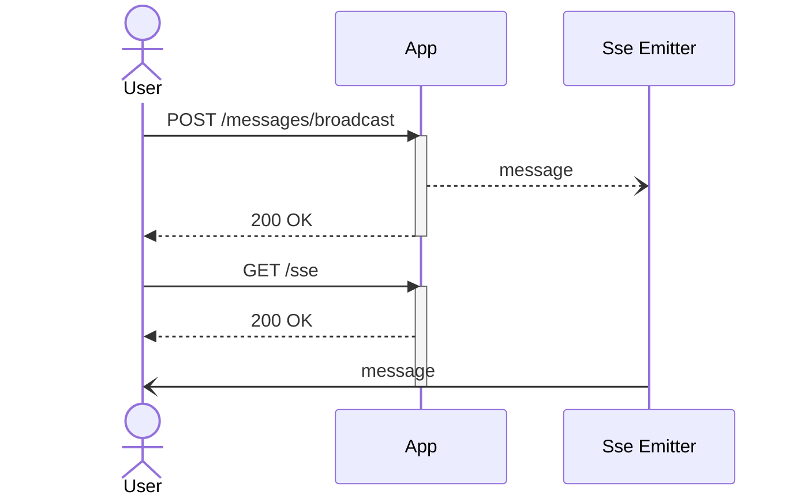

# What will we do

Service which will broadcast received messages through an SSE connection to any subscribed user



```json
{
  "openapi": "3.1.0",
  "info": {
    "title": "SSE broadcast API",
    "description": "Quarkus SSE example",
    "version": "1.0.0"
  },
  "servers": [
    {
      "url": "http://localhost:8080"
    }
  ],
  "paths": {
    "/messages/broadcast": {
      "post": {
        "summary": "Broadcast message",
        "operationId": "broadcastMessage",
        "tags": [
          "messages"
        ],
        "requestBody": {
          "description": "Message to broadcast",
          "required": true,
          "content": {
            "application/json": {
              "schema": {
                "$ref": "#/components/schemas/MessageToBroadcast"
              },
              "example": "broadcast this message :rocket:"
            }
          }
        },
        "responses": {
          "200": {
            "description": "message received"
          }
        }
      }
    }
  },
  "components": {
    "schemas": {
      "MessageToBroadcast": {
        "type": "object",
        "required": [
          "message"
        ],
        "properties": {
          "message": {
            "type": "string"
          }
        }
      }
    }
  }
}
```
# References
- [Server-sent events](https://html.spec.whatwg.org/multipage/server-sent-events.html)
- [Quarkus](https://quarkus.io/)
- [AsyncAPI](https://www.asyncapi.com/)
- [OpenAPI](https://www.openapis.org/)
