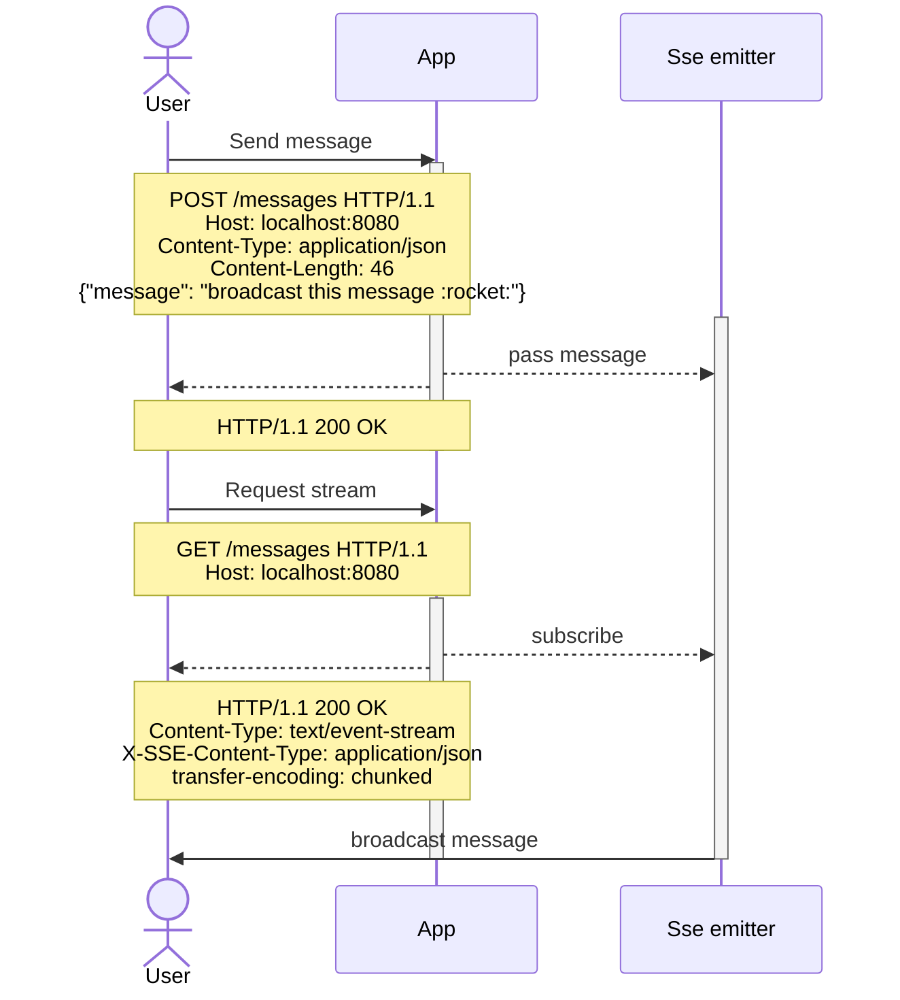

Let's assume that we have service which allows some users to send messages and others to receive them.

The most interesting moment for me is to compare the [OpenAPI](https://www.openapis.org) specification with the [AsyncAPI](https://www.asyncapi.com) specification in the next cases and compare results:

- Use common [Json Schemas](https://json-schema.org) to reduce needed work
- Describe SSE connection with HTTP operation for messages sending

## What will we document

Service which will:
- Broadcast received messages through a [Server-Sent Events](https://html.spec.whatwg.org/multipage/server-sent-events.html#server-sent-events) (SSE) connection to any subscribed user
- Receive messages for broadcasting trough HTTP Resource `/messages`

Diagram:



## Common part

Let's collect all required schemas in one file:

```yaml
schemas:
  Message:
    type: object
    additionalProperties: false
    required:
      - message
      - receivedAt
    properties:
      message:
        type: string
        example: 'broadcast this message :rocket:'
      receivedAt:
        type: string
        format: date-time
        example: '2023-08-31T15:28:21.283+00:00'
        description: Date-time when application received this message
  MessageToBroadcast:
    type: object
    additionalProperties: false
    required:
      - message
    properties:
      message:
        type: string
        example: 'broadcast this message :rocket:'
        description: Ordinary text which will be send
```
{: file='schemas.yaml'}

## OpenAPI

### Broadcast messages

Just basic declaration of `POST` method, nothing special at all

```yaml
openapi: 3.0.3
info:
  version: 1.0.0
  title: Messages API
  description: >-
    Broadcasts received messages through an SSE connection to any subscribed
    user
servers:
  - url: 'http://localhost:8080'
paths:
  /messages:
    post:
      summary: Broadcast message
      operationId: broadcastMessage
      description: Send message to broadcast to any subscribed user
      tags:
        - messages
      requestBody:
        description: Message to broadcast
        required: true
        content:
          application/json:
            schema:
              $ref: './schemas.json#/schemas/MessageToBroadcast'
            example: 'broadcast this message :rocket:'
      responses:
        '200':
          description: message received
```
{: file='OpenAPI send message'}

### Subscribe to messages stream

More complicated part.

Unfortunately, community still figuring out how to describe events by OpenAPI in the right manner.

We can use this [GitHub issue](https://github.com/OAI/OpenAPI-Specification/issues/396) as a reference,
to try to find approach to describe `stream`

We will use next steps for describing:
1. Define path `/messages`
2. Tell that stream will be returned after `GET` request
3. Describe SSE headers in response:
   - Content-Type: text/event-stream
   - X-SSE-Content-Type: application/json
4. Decide how to describe response content

Let's assume that we can describe payload correctly as follows:

```yaml
MessagesStream:
  type: array # it's stream of messages, so array is a good wrapper
  format: event-stream # SSE is about events, so it's event stream
  items:
    $ref: './schemas.json#/schemas/Message'
```
{: file='Messages Stream'}

```yaml
openapi: 3.0.3
info:
  version: 1.0.0
  title: Messages stream API
  description: >-
    Broadcasts received messages through an SSE connection to any subscribed
    user
servers:
  - url: 'http://localhost:8080'
paths:
  /messages: # 1. Define path
    get: # 2. How to invoke stream
      summary: Subscribe to stream of messages
      operationId: messagesStreamSubscribe
      description: Receive all incoming messages
      tags:
        - messages
      responses:
        '200':
          description: Stream of messages
          headers: #3. SSE headers
            X-SSE-Content-Type:
              schema:
                type: string
                enum:
                  - application/json
            transfer-encoding:
              schema:
                type: string
                enum:
                  - chunked
          content: # 3. Right type of content-type
            text/event-stream:
              schema:
                $ref: '#/components/schemas/MessagesStream' # 4. Describe response content
components:
  schemas:
    MessagesStream:
      type: array
      format: event-stream
      items:
        $ref: './schemas.json#/schemas/Message'
```
{: file='OpenAPI subscribe to messages stream'}

### Pub + Sub

Now let's compose our contracts into one

```yaml
openapi: 3.0.3
info:
  version: 1.0.0
  title: Messages API
  description: >-
    Broadcasts received messages through an SSE connection to any subscribed
    user
servers:
  - url: 'http://localhost:8080'
paths:
  /messages:
    get:
      summary: Subscribe to stream of messages
      operationId: messagesStreamSubscribe
      description: Receive all incoming messages
      tags:
        - messages
      responses:
        '200':
          description: Stream of messages
          headers:
            X-SSE-Content-Type:
              schema:
                type: string
                enum:
                  - application/json
            transfer-encoding:
              schema:
                type: string
                enum:
                  - chunked
          content:
            text/event-stream:
              schema:
                $ref: '#/components/schemas/MessagesStream'
    post:
      summary: Broadcast message
      operationId: broadcastMessage
      description: Send message to broadcast to any subscribed user
      tags:
        - messages
      requestBody:
        description: Message to broadcast
        required: true
        content:
          application/json:
            schema:
              $ref: '../schemas.json#/schemas/MessageToBroadcast'
            example: 'broadcast this message :rocket:'
      responses:
        '200':
          description: message received
components:
  schemas:
    MessagesStream:
      type: array
      format: event-stream
      items:
        $ref: './schemas.json#/schemas/Message'
```
{: file='OpenAPI Pub/Sub'}

## AsyncAPI

### Broadcast messages

Let's describe `POST` request for message sending

We will use next steps for describing:
1. Define channel `/messages`
2. Add `publish` operation
3. Bind operation with `HTTP`:
   - Operation: `POST`
   - Type: `request`

```yaml
asyncapi: 2.6.0
info:
  title: Messages stream API
  description: >-
    Broadcasts received messages through an SSE connection to any subscribed
    user
  version: 1.0.0
servers:
  dev:
    url: 'http://localhost:8080'
    protocol: http
channels:
  /messages: # 1. Messages chanel
    description: Broadcast message
    publish: # 2. Publish message
      description: Send message to broadcast to any subscribed user
      message:
        bindings:
          http: # 3. Use this HTTP headers
            headers:
              type: object
              additionalProperties: false
              required:
                - Content-Type
              properties:
                Content-Type:
                  type: string
                  enum:
                    - application/json
        $ref: '#/components/messages/MessageToBroadcast'
      bindings: # 3. For POST operation
        http:
          type: request
          method: POST
components:
  messages:
    MessageToBroadcast:
      payload:
        $ref: './schemas.json#/schemas/MessageToBroadcast'
```
{: file='AsyncAPI send message'}

### Subscribe to messages stream

Easiest part, is a messages stream description.

We will use next steps for describing:
1. Define channel `/messages`
2. Add `subscribe` operation
3. Bind operation with `HTTP`:
  - Operation: `GET`
  - Type: `request`

```yaml
asyncapi: 2.6.0
info:
  title: Messages stream API
  description: >-
    Broadcasts received messages through an SSE connection to any subscribed
    user
  version: 1.0.0
servers:
  dev:
    url: 'http://localhost:8080'
    protocol: http
channels:
  /messages: # 1. Define chanel
    description: Subscribe to stream of messages
    subscribe: # 2. Subscribe to it
      description: Receive all incoming messages
      message:
        bindings:
          http: # 3. Expect next HTTP headers
            headers:
              type: object
              additionalProperties: false
              required:
                - Content-Type
                - X-SSE-Content-Type
                - transfer-encoding
              properties:
                Content-Type:
                  type: string
                  enum:
                    - text/event-stream
                X-SSE-Content-Type:
                  type: string
                  enum:
                    - application/json
                transfer-encoding:
                  type: string
                  enum:
                    - chunked
        $ref: '#/components/messages/Message' # 3. With next events
      bindings:
        http: # 3. In response for GET request
          type: request
          method: GET
components:
  messages:
    Message:
      payload:
        $ref: './schemas.json#/schemas/Message'

```
{: file='AsyncAPI subscribe to messages stream'}

### Pub + Sub

Now let's compose our contracts into one

```yaml
asyncapi: 2.6.0
info:
  title: Messages stream API
  description: >-
    Broadcasts received messages through an SSE connection to any subscribed
    user
  version: 1.0.0
servers:
  dev:
    url: 'http://localhost:8080'
    protocol: http
channels:
  /messages:
    description: Broadcast message
    publish:
      description: Send message to broadcast to any subscribed user
      message:
        bindings:
          http:
            headers:
              type: object
              additionalProperties: false
              required:
                - Content-Type
              properties:
                Content-Type:
                  type: string
                  enum:
                    - application/json
        $ref: '#/components/messages/MessageToBroadcast'
      bindings:
        http:
          type: request
          method: POST
    subscribe:
      description: Receive all incoming messages
      message:
        bindings:
          http:
            headers:
              type: object
              additionalProperties: false
              required:
                - Content-Type
                - X-SSE-Content-Type
                - transfer-encoding
              properties:
                Content-Type:
                  type: string
                  enum:
                    - text/event-stream
                X-SSE-Content-Type:
                  type: string
                  enum:
                    - application/json
                transfer-encoding:
                  type: string
                  enum:
                    - chunked
        $ref: '#/components/messages/Message'
      bindings:
        http:
          type: request
          method: GET
components:
  messages:
    MessageToBroadcast:
      payload:
        $ref: './schemas.json#/schemas/MessageToBroadcast'
    Message:
      payload:
        $ref: './schemas.json#/schemas/Message'
```
{: file='AsyncAPI Pub/Sub'}

## Resume

Both specifications allow to you to describe Pub and Sub operations for our demo app, but with some tradeoffs

OpenAPI can't offer canonical way how to describe stream.

For example:
> ```json
> {
>   "type": "array",
>   "format": "event-stream",
>   "items": {
>     "$ref": "../schemas.json#/schemas/Message"
>   }
> }
> ```

What does it mean? Stream of messages? Stream of arrays with messages?

From other side AsyncAPI as expected can't offer flexible syntax for description of HTTP requests - headers, params location, status codes

It's up to you to choose which specification to use, but looks like it's better to use them both, instead of reinvent the wheel:
- [Swagger for Server Sent Events](https://github.com/OAI/OpenAPI-Specification/issues/396)
- [Swagger for WebSocket services](https://github.com/OAI/OpenAPI-Specification/issues/55#issuecomment-1057220490)

# References
- [Server-sent events](https://html.spec.whatwg.org/multipage/server-sent-events.html)
- [AsyncAPI](https://www.asyncapi.com/)
- [OpenAPI](https://www.openapis.org/)
