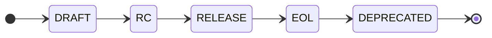

## Intro

For a long time, I couldn't finalize the draft of this note to publish it. I would sit down, sketch diagrams,
write introductions like: "I've been working with APIs for a long time; it all started back then, evolved this way, and now I'm here, talking about APIs as dependencies that need proper maintenance."

I tried to formulate justifications for a simple idea — API is a product with its own lifecycle — and now it's time to try a new format

In this note, I want to gather feedback, refine it, and create a prototype

## Motivation

There are plenty of services where I can store my API, publish documentation, create portals, and so on. But I don’t have a clear understanding of how to work with APIs

I primarily code in Java, so before I start writing anything, I open GitHub and Maven Central to find the right packages to work with. If I'm using Spring or Quarkus, I can even request a skeleton of the future service — for example, via https://code.quarkus.io

Next, I launch my IDE, import the project, and easily track all dependency changes declared in `pom.xml`, for example

But when it comes to API integration, things get really messy:

First, I need to find the API. If it's in OpenAPI or AsyncAPI format, that's great — I can download it and generate clients (even better if there’s a dependency available, which I still need to match correctly with the API version).

If there are no clients/DTOs/other artifacts, I have to generate everything manually or use an agent, hoping the contract was written correctly and everything works on the first try

This problem isn’t new — otherwise, we wouldn’t have so many package repositories:
- NPM
- Maven Central
- etc.

In my mind, a simple concept has formed: API + artifacts = API Repository — which any vendor could implement

## API Repository

An important clarification — the goal of an API Repository is not to replace existing API inventory solutions, of which there are plenty:
- https://www.eventcatalog.dev/
- https://bump.sh/
- https://www.postman.com/
- Own Git repo
- etc.

But rather to act as a glue—a standard that connects an API with its corresponding packages.

To achieve this, only two dependencies are needed:
1. A URL to the API contract
2. Package coordinates in various repositories

### API Lifecycle

I don’t want to overcomplicate things, so I propose a familiar lifecycle



States:
- `Draft` – A draft version of the API that is still evolving.
- `RC` (Release Candidate) – The API structure is stable, with only minor changes expected.
- `Release` – The API is officially released and will not change.
- `EOL` (End of Life) – The API will soon be retired, and its use is not recommended.
- `Deprecated` – The API has been fully decommissioned and can no longer be used.

Restrictions Based on Lifecycle:
- `Draft`, `RC` APIs are available for:
  - Reading
  - Writing
- `Release`, `EOL`, `Deprecated` APIs are available for:
  - Reading only

Now it's clearer which phase the API is in and when it will be decommissioned

### API Repository structure

#### Storing APIs

An API can be stored anywhere, so focusing on its storage isn't necessary. Instead, it's enough to define a structure that includes:
- The API contract
- The current lifecycle phase
- The availability of artifacts in package managers

##### How It Works in Practice

As the API contract is finalized, we generate a URN and register it in the repository

```yaml
urn: com.myCompanyName:asyncapi:chat-api-gateway:2.34.0
cycle: Draft
contract:
  $ref: 'https://api-hub.com/apis/asyncapi/5a0052fd-fd49-4eb1-a257-1f246906a0da'
```
{:file='API'}

Next, if possible, we generate the necessary packages from the contract and publish them in repositories

```yaml
urn: com.myCompanyName:asyncapi:chat-api-gateway:2.34.0
cycle: Release
contract:
  $ref: 'https://api-hub.com/apis/asyncapi/5a0052fd-fd49-4eb1-a257-1f246906a0da'
artifacts:
  maven:
    - language: java
      framework: any # spring-boot | quarkus | micronaut
      dependency: # com.github.myCompanyName:chat-api-gateway:2.34.0
        groupId: com.myCompanyName
        artifactId: chat-api-gateway
        version: 2.34.0
  npm:
    - language: type-script
      dependency: # "@myCompanyName/chat-api-gateway": "2.34.0"
        groupId: myCompanyName
        artifactId: chat-api-gateway
        version: 2.34.0
```
{:file='API'}

When the API is ready for an update or deprecation, we move it to `EOL`, indicating when this will happen and what alternatives are available

```yaml
urn: com.myCompanyName:asyncapi:chat-api-gateway:2.34.0
cycle: EOL
deprecationNotice:
  note: Current version of API will be deprecated at 2025-09-26
  eliminationDate: 2025-09-26
  successor:
    urn: com.myCompanyName:asyncapi:chat-api-gateway:3.0.0
contract:
  $ref: 'https://api-hub.com/apis/asyncapi/5a0052fd-fd49-4eb1-a257-1f246906a0da'
artifacts:
  maven:
    - language: java
      framework: any # spring-boot | quarkus | micronaut
      dependency: # com.github.myCompanyName:chat-api-gateway:2.34.0
        groupId: com.myCompanyName
        artifactId: chat-api-gateway
        version: 2.34.0
  npm:
    - language: type-script
      dependency: # "@myCompanyName/chat-api-gateway": "2.34.0"
        groupId: myCompanyName
        artifactId: chat-api-gateway
        version: 2.34.0
```

Ultimately, we move it to the `Deprecated` lifecycle phase

#### Working with APIs

There is a place to fetch the API from, so it's time to figure out how to do that

It will all start with `api.yaml` at the root of the project, which we will create

```shell
touch api.yaml
```

In the manifest, we will list the repositories we need and the parameters for searching and building the API packages

```yaml
repositories:
  - id: central
    url: https://www.eventcatalog.dev/.well-known/api-repository
  - id: myCompanyName_repo_1
    url: https://github.com/myCompanyName/ai-apis/tree/main/.well-known/api-repository
  - id: myCompanyName_repo_2
    url: https://github.com/myCompanyName/chat-apis/tree/main/.well-known/api-repository

build:
  jvm:
    language: java
    framework: quarkus
    build-tool: maven
    build-file-path: ./pom.xml
  dependencies-have-priority: true
```
{:file='api.yaml'}

Once the repositories are listed, we can specify the APIs we are using

```yaml
apis:
  - groupId: com.github.myCompanyName
    type: asyncapi
    apiId: chat-api-gateway
    version: 2.34.0
```
{:file='api.yaml'}

If we are only interested in specific operations, we have the option to specify only those

```yaml
apis:
  - groupId: com.github.myCompanyName
    type: openapi
    apiId: chat-api-ai-assistant
    version: 1.3.0
    operationIds:
      - aiGenerateChatBlock
      - aiGetChatBlockSchemas
```
{:file='api.yaml'}

Once the manifest is ready, you can work with it via the CLI

Reviewing dependencies

```shell
➜ git:(main) ✗ apim ls
demo-project@1.6.0 /Users/pavelbodyachevskiy/IdeaProjects/demo-project
├── com.github.myCompanyName:asyncapi:chat-api-gateway:2.34.0
├─┬ com.github.myCompanyName:openapi:chat-api-ai-assistant:1.3.0
│ ├── aiGenerateChatBlock
│ ├── aiGetChatBlockSchemas
```

Adding new API

```shell
➜ git:(main) ✗ apim install com.github.myCompanyName:asyncapi:notifications-api:1.73.25:subscribeForRejectedMessages
```

Building project

```shell
➜ git:(main) ✗ apim build
```

During the build process, we go to the API Repository and check the lifecycle phase of the API and whether it has the appropriate packages. 
In the case of `Draft`, `RC`, `EOL`, or `Deprecated`, we display a warning while continuing the project build

If the API has packages, we add the dependency

```xml
<dependencies>
    <!-- Chat API AI Assistant Client -->
    <dependency>
        <groupId>com.github.myCompanyName</groupId>
        <artifactId>chat-api-gateway</artifactId>
        <version>2.34.0</version>
    </dependency>
</dependencies>
```

If that's not possible, we generate the necessary package locally

```shell
find . -type f
./generated/src/main/java/com.example/inegrations/com.github.myCompanyName/asyncapi/notifications-api/v_1_73_25/RejectedMessagesListener.java
./src/main/java/Application.java
./api.yaml
./pom.xml
```

## Conclusion

In this note, I want to show that the introduction of a small standard can make working with APIs easier

There’s a repository you can refer to. It will tell you which APIs are current, which are not, and whether they have official packages that can be reused.

By writing an IDE extension:
- I can retrieve information in the background about APIs that are going to be deprecated, and update them in time
- Implement autocomplete and documentation display for used APIs
- Pass the necessary information to the agent via MCP for code generation or to find the required API

What do you think?
